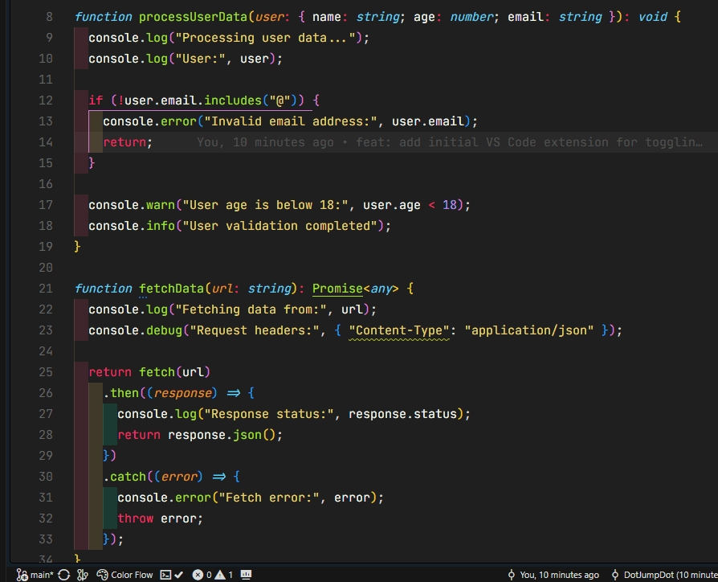

# Console.log Toggle Comment

[](https://github.com/dotjumpdot/consolelog-toggle-comment)
[](LICENSE)
[](https://code.visualstudio.com)

A simple yet powerful VS Code extension that provides a one-click solution to toggle all `console.log` statements in the active editor between commented and uncommented states.

## 📺 Demo



> Watch how Console.log Toggle Comment instantly toggles all console statements with a single click

## Extension Info

| Property         | Value                                                                                                                 |
| ---------------- | --------------------------------------------------------------------------------------------------------------------- |
| **Name**         | Console.log Toggle Comment                                                                                            |
| **Extension ID** | `DotJumpDot.consolelog-toggle-comment`                                                                                |
| **Description**  | One-click solution to toggle all console.log statements in the active editor between commented and uncommented states |
| **Version**      | 1.0.2                                                                                                                 |
| **Publisher**    | DotJumpDot (JM)                                                                                                       |
| **Marketplace**  | [VS Marketplace](https://marketplace.visualstudio.com/items?itemName=DotJumpDot.consolelog-toggle-comment)            |

## Features

- **One-Click Toggle**: Instantly toggle all console statements with a single click
- **Status Bar Icon**: Convenient button in the bottom-left status bar for quick access
- **Keyboard Shortcut**: Default `Ctrl+Alt+L` (Windows/Linux) or `Cmd+Alt+L` (Mac)
- **Multiple Console Methods**: Supports `console.log`, `console.error`, `console.warn`, `console.info`, and `console.debug`
- **Smart Detection**: Only toggles actual console statements, preserving other code
- **Custom Keybinding**: Map your own keyboard shortcut via the command palette
- **Visual Feedback**: Shows count of toggled statements with active/commented breakdown

## Installation

### From VS Code Marketplace

1. Open VS Code
2. Go to Extensions (Ctrl+Shift+X)
3. Search for "Console.log Toggle Comment"
4. Click "Install"

### From Source

1. Clone this repository:

   ```bash
   git clone https://github.com/dotjumpdot/consolelog-toggle-comment.git
   cd consolelog-toggle-comment
   ```

2. Install dependencies:

   ```bash
   npm install
   ```

3. Build the extension:

   ```bash
   npm run compile
   ```

4. Package the extension:

   ```bash
   vsce package
   ```

5. Install the generated `.vsix` file in VS Code

## Usage

### Using Status Bar

1. Open any JavaScript or TypeScript file
2. Click the **Toggle Console** button in the bottom-left status bar
3. All console statements will be toggled between commented and uncommented states

### Using Keyboard Shortcut

Press `Ctrl+Alt+L` (Windows/Linux) or `Cmd+Alt+L` (Mac) to toggle console statements.

### Using Command Palette

1. Press `Ctrl+Shift+P` to open the Command Palette
2. Type "Console.log Toggle Comment: Toggle Console Statements"
3. Press Enter to execute

### Custom Keybinding

1. Press `Ctrl+Shift+P` to open the Command Palette
2. Type "Console.log Toggle Comment: Map Key"
3. Press Enter to open the keybindings.json file
4. Add your custom keybinding:
   ```json
   {
     "key": "your-custom-keybinding",
     "command": "consolelogToggle.toggle"
   }
   ```

## Examples

### Before Toggle

```javascript
function calculateSum(a, b) {
  console.log("Calculating sum...");
  const result = a + b;
  console.log("Result:", result);
  return result;
}

console.error("This is an error");
console.warn("This is a warning");
console.info("This is info");
console.debug("Debugging information");
```

### After Toggle

```javascript
function calculateSum(a, b) {
  // console.log('Calculating sum...');
  const result = a + b;
  // console.log('Result:', result);
  return result;
}

// console.error('This is an error');
// console.warn('This is a warning');
// console.info('This is info');
// console.debug('Debugging information');
```

### Toggle Again to Restore

Click the status bar button or use the keyboard shortcut again to uncomment all console statements.

## Supported Console Methods

- `console.log()`
- `console.error()`
- `console.warn()`
- `console.info()`
- `console.debug()`

## Configuration

No configuration is required. The extension works out of the box with the default settings.

## Requirements

- VS Code version 1.80.0 or higher
- Node.js 18.0.0 or higher (for development)

## Development

### Prerequisites

- Node.js 18+
- VS Code
- Git

### Setup

1. Clone the repository
2. Install dependencies:

   ```bash
   npm install
   ```

3. Run the extension in debug mode:
   - Open the project in VS Code
   - Press `F5` or go to `Run > Start Debugging`
   - A new VS Code window will open with the extension loaded

### Building

```bash
npm run compile
```

### Testing

```bash
npm run test
```

### Linting

```bash
npm run lint
```

## Changelog

See [CHANGELOG.md](CHANGELOG.md) for a detailed history of changes.

## Contributing

Contributions are welcome! Please feel free to submit a Pull Request.

1. Fork the repository
2. Create your feature branch (`git checkout -b feature/amazing-feature`)
3. Commit your changes (`git commit -m 'Add some amazing feature'`)
4. Push to the branch (`git push origin feature/amazing-feature`)
5. Open a Pull Request

## License

This project is licensed under the MIT License - see the [LICENSE](LICENSE) file for details.

## Author

**DotJumpDot** - 2026

## Support

If you encounter any issues or have questions, please [open an issue](https://github.com/dotjumpdot/consolelog-toggle-comment/issues) on GitHub.

## Acknowledgments

- Built with [VS Code Extension API](https://code.visualstudio.com/api)
- Inspired by the need for quick debugging workflow improvements

## Related Extensions

- [Better Comments](https://marketplace.visualstudio.com/items?itemName=aaron-bond.better-comments) - Improve your code commenting experience
- [Todo Tree](https://marketplace.visualstudio.com/items?itemName=Gruntfuggly.todo-tree) - Show all TODOs in a tree view
